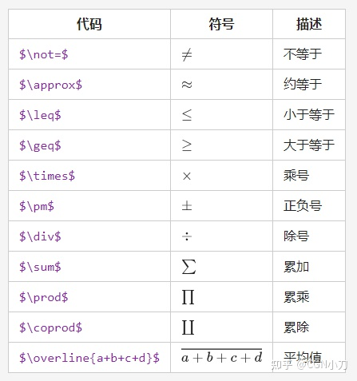
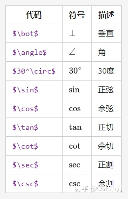
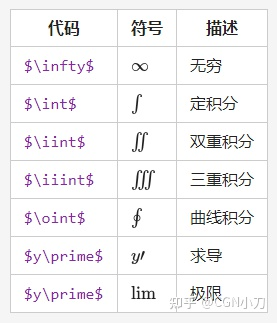
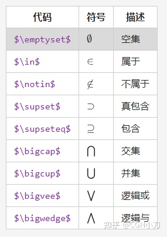
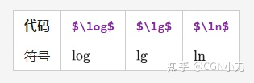
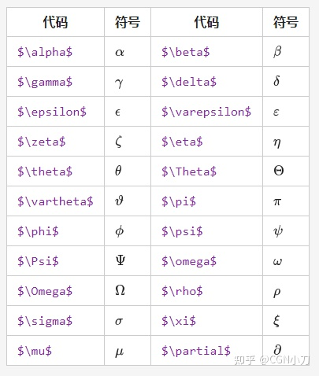

# 0math

 [](https://www.npmjs.com/package/0math)

- [Api docs](https://0math.github.io/)
- 常用数学方法的封装

## 使用

```shell
npm install 0math -D
```

> 期望值, 平均, 众数, 中位数

```js
import { add } from '0math'
```

 $(x^2 + x^y )^{x^y}+ x_1^2= y_1 - y_2^{x_1-y_1^2}$

 $\frac{1-x}{y+1}$

 $x\over{x+y}$

 $\sqrt[3]{4}$

 $\sqrt{9}$

 $f(x, y) = x^2 + y^2, x \epsilon [0, 100], y \epsilon \{1,2,3\}$

$(\sqrt{1 \over 2})^2$

 $\left(\sqrt{1 \over 2}\right)^2$

 $\frac{du}{dx}|{x=0}$

 $\left. \frac{du}{dx} \right|_{x=0}$

 $y :\begin{cases} x+y=1\\ x-y = 0 \end{cases}$

 向量: $\vec{a}$

例 ： $\vec a \cdot \vec b = 1$

定积分: $\int_0^1x^2dx$

极限: $\lim_{n\rightarrow+\infty}$

符号：$\lim_{n\rightarrow+\infty}$，示例公式：$\lim_{n\rightarrow+\infty}\frac{1}{n}$

$f(x_1,x_2,\ldots,x_n) = \left({1 \over x_1}\right)^2+\left({1 \over x_2}\right)^2+\cdots+\left({1 \over x_n}\right)^2$

累加$\sum_1^n$, 累乘$\prod_{i=0}^n$

数学符号



三角函数



定积分



集合



对数



希腊


